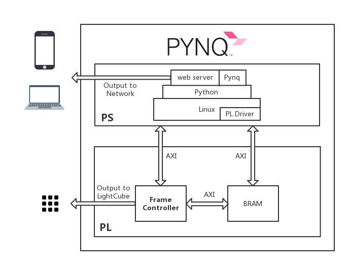

# PYNQ Light Cube

## Brief Introduction

This repo shows how to write a controller in python to control peripherals connected to FPGA. We can write any peripheral drivers in FPGA to achieve real-time high speed signal processing. Thanks to PYNQ platform, we can easily wrapper the FPGA drivers into simple python code.

- [Introduction to  lightcube on pynq](https://youtu.be/MuuaV33cSX0) and [slides](Light-Cube-Introduction.pdf)
- [Demo video](https://youtu.be/FeuXpvO6rtA)
- [Run playground.ipynb](image/01.gif)
- [Click webpage to control single LED](image/02.gif)
- [Run pre-defined patterns](image/03.gif)

## Birdview



## Get Started

> Based on PYNQ Image 2.0

1. Clone this repo on PYNQ board: `git clone https://github.com/sonnyhcl/PYNQ-Light-Cube.git`

2. Run the `setup` bash script to setup lightcube: `bash PYNQ-Light-Cube/setup.sh`

3. Open your browser with `<pynq_ip>:9090` and type in `xilinx` as password.

4. Get started using `LightCube_GetStated` notebook.

5. Find `LightCube_Playground` notebook and run. Then you can turn into `<pynq_ip>:8080` to view a webpage displaying real-time status of lightcube.

> tips: `<pynq_ip>` is the ip of your pynq.

## Repository Organisation

This repository is organized as follows.

- `hw` contains constraints source file, custom ip, and `tcl` file to rebuild whole hardware design.

- `notebook` contains lightcube controller in python, webserver resources, and notebook for playing.

- `overlay` contains `bit` and `tcl` file of hardware design, and `py` to import overlay.

- `setup.sh` helps setting up this lightcube package.

```console
.
├── hw
│   ├── ip
│   ├── build_hw.tcl
│   └── srcs
├── image
│   └── framework.png
├── notebook
│   ├── lc_const.py
│   ├── lc_pynq.py
│   ├── LightCube_GetStarted.ipynb
│   ├── LightCube_Playground.ipynb
│   ├── static
│   └── templates
├── overlay
│   ├── __init__.py
│   ├── lightcube.bit
│   ├── lightcube.py
│   └── lightcube.tcl
├── README.md
└── setup.sh
```

## Hardware Design Rebuilt
In order to rebuild this hardware design, you should clone this repo in a machine installed with `Vivado 2016.1`(only tested with `Vivado 2016.1`).

1. Clone this repo: `git clone https://github.com/sonnyhcl/PYNQ-Light-Cube.git`

2. Change your work directory: `cd hw`

3. Make sure you have successfully configure you vivado environments: `source build_hw.tcl`

4. Wait for a minute and then you can open the new-built projects.


# Based On PYNQ

This project is based on PYNQ. You can find it → [here](https://github.com/Xilinx/PYNQ/).
